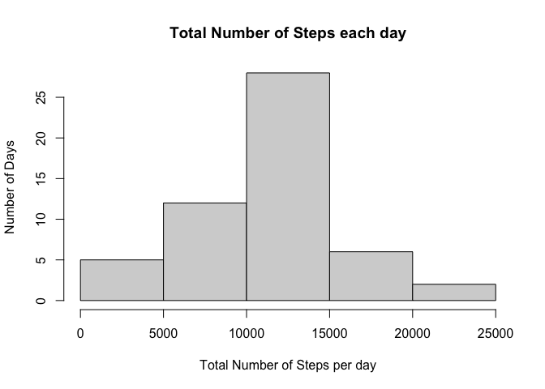
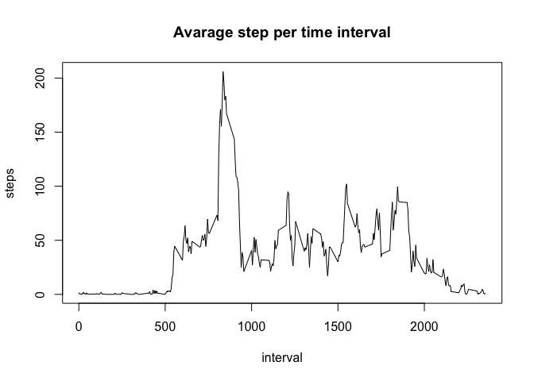
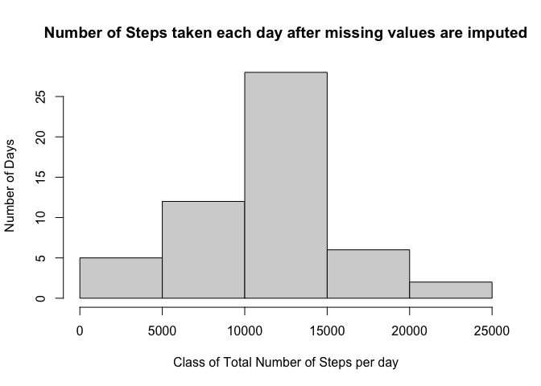
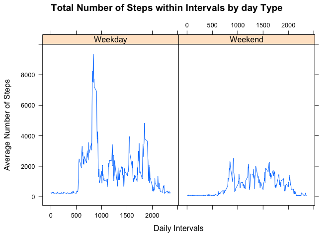

## Loading and preprocessing the data


```r
unzip("./activity.zip")
datos_actividad <- read.csv("./activity.csv")
summary(datos_actividad)
```

```
##      steps            date              interval     
##  Min.   :  0.00   Length:17568       Min.   :   0.0  
##  1st Qu.:  0.00   Class :character   1st Qu.: 588.8  
##  Median :  0.00   Mode  :character   Median :1177.5  
##  Mean   : 37.38                      Mean   :1177.5  
##  3rd Qu.: 12.00                      3rd Qu.:1766.2  
##  Max.   :806.00                      Max.   :2355.0  
##  NA's   :2304
```

```r
head(datos_actividad)
```

```
##   steps       date interval
## 1    NA 2012-10-01        0
## 2    NA 2012-10-01        5
## 3    NA 2012-10-01       10
## 4    NA 2012-10-01       15
## 5    NA 2012-10-01       20
## 6    NA 2012-10-01       25
```

```r
str(datos_actividad)
```

```
## 'data.frame':	17568 obs. of  3 variables:
##  $ steps   : int  NA NA NA NA NA NA NA NA NA NA ...
##  $ date    : chr  "2012-10-01" "2012-10-01" "2012-10-01" "2012-10-01" ...
##  $ interval: int  0 5 10 15 20 25 30 35 40 45 ...
```


## What is mean total number of steps taken per day?

##1. Calculate the total number of steps taken per day

```r
pasos_por_dia <- aggregate(steps ~ date, datos_actividad, sum, na.rm=TRUE)
pasos_por_dia
```

```
##          date steps
## 1  2012-10-02   126
## 2  2012-10-03 11352
## 3  2012-10-04 12116
## 4  2012-10-05 13294
## 5  2012-10-06 15420
## 6  2012-10-07 11015
## 7  2012-10-09 12811
## 8  2012-10-10  9900
## 9  2012-10-11 10304
## 10 2012-10-12 17382
## 11 2012-10-13 12426
## 12 2012-10-14 15098
## 13 2012-10-15 10139
## 14 2012-10-16 15084
## 15 2012-10-17 13452
## 16 2012-10-18 10056
## 17 2012-10-19 11829
## 18 2012-10-20 10395
## 19 2012-10-21  8821
## 20 2012-10-22 13460
## 21 2012-10-23  8918
## 22 2012-10-24  8355
## 23 2012-10-25  2492
## 24 2012-10-26  6778
## 25 2012-10-27 10119
## 26 2012-10-28 11458
## 27 2012-10-29  5018
## 28 2012-10-30  9819
## 29 2012-10-31 15414
## 30 2012-11-02 10600
## 31 2012-11-03 10571
## 32 2012-11-05 10439
## 33 2012-11-06  8334
## 34 2012-11-07 12883
## 35 2012-11-08  3219
## 36 2012-11-11 12608
## 37 2012-11-12 10765
## 38 2012-11-13  7336
## 39 2012-11-15    41
## 40 2012-11-16  5441
## 41 2012-11-17 14339
## 42 2012-11-18 15110
## 43 2012-11-19  8841
## 44 2012-11-20  4472
## 45 2012-11-21 12787
## 46 2012-11-22 20427
## 47 2012-11-23 21194
## 48 2012-11-24 14478
## 49 2012-11-25 11834
## 50 2012-11-26 11162
## 51 2012-11-27 13646
## 52 2012-11-28 10183
## 53 2012-11-29  7047
```

#Make a histogram of the total number of steps taken each day

```r
hist(pasos_por_dia$steps, xlab="Total Number of Steps per day", ylab="Number of Days", main="Total Number of Steps each day")
```

<!-- -->


##3. Calculate and report the mean and median of the total number of steps taken per day

```r
media<-mean(pasos_por_dia$steps)
media
```

```
## [1] 10766.19
```


```r
mediana<-median(pasos_por_dia$steps)
mediana
```

```
## [1] 10765
```


## What is the average daily activity pattern?

##1. Make a time series plot of the 5-minute interval (x-axis) and the average number of steps taken, averaged across all days (y-axis)

```r
pasos_por_intervalo<-aggregate(steps~interval, data=datos_actividad, mean, na.rm=TRUE)
plot(steps~interval, data=pasos_por_intervalo, type="l", main="Avarage step per time interval")
```

<!-- -->


##2. Which 5-minute interval, on average across all the days in the dataset, contains the maximum number of steps?


```r
intervalo_max_pasos <- pasos_por_intervalo[which.max(pasos_por_intervalo$steps),]$interval
intervalo_max_pasos
```

```
## [1] 835
```


## Imputing missing values

##1. Calculate and report the total number of missing values in the dataset (i.e. the total number of rows with \color{red}{\verb|NA|}NAs)


```r
valoresNA<-sum(is.na(datos_actividad[,1]))
valoresNA
```

```
## [1] 2304
```


##2. Devise a strategy for filling in all of the missing values in the dataset. The strategydoes not need to be sophisticated. For example, you could use the mean/median for that day, or the mean for that 5-minute interval, etc.

```r
m<-mean(pasos_por_intervalo$steps)
m
```

```
## [1] 37.3826
```

##3. Create a new dataset that is equal to the original dataset but with the missing data filled in.


```r
datos_actividad2<-datos_actividad
datos_actividad2[is.na(datos_actividad[,1]),1]<-m
head(datos_actividad2)
```

```
##     steps       date interval
## 1 37.3826 2012-10-01        0
## 2 37.3826 2012-10-01        5
## 3 37.3826 2012-10-01       10
## 4 37.3826 2012-10-01       15
## 5 37.3826 2012-10-01       20
## 6 37.3826 2012-10-01       25
```


##4. Make a histogram of the total number of steps taken each day and Calculate and report the mean and median total number of steps taken per day. Do these values differ from the estimates from the first part of the assignment? What is the impact of imputing missing  data on the estimates of the total daily number of steps?


```r
total_pasos_dia1<-aggregate(steps~date, datos_actividad, sum)
hist(total_pasos_dia1$steps, xlab="Class of Total Number of Steps per day", 
     ylab="Number of Days", main="Number of Steps taken each day after missing values are imputed")
```

<!-- -->


## Are there differences in activity patterns between weekdays and weekends?

##1. Create a new factor variable in the dataset with two levels – “weekday” and “weekend” indicating whether a given date is a weekday or weekend day.

```r
datos_actividad2$date<-as.Date(datos_actividad2$date)
library(dplyr)
```

```
## 
## Attaching package: 'dplyr'
```

```
## The following objects are masked from 'package:stats':
## 
##     filter, lag
```

```
## The following objects are masked from 'package:base':
## 
##     intersect, setdiff, setequal, union
```

```r
datos_actividad3<-datos_actividad2%>%
  mutate(dayType= ifelse(weekdays(datos_actividad2$date)=="Saturday" | weekdays(datos_actividad2$date)=="Sunday", "Weekend", "Weekday"))
head(datos_actividad3)
```

```
##     steps       date interval dayType
## 1 37.3826 2012-10-01        0 Weekday
## 2 37.3826 2012-10-01        5 Weekday
## 3 37.3826 2012-10-01       10 Weekday
## 4 37.3826 2012-10-01       15 Weekday
## 5 37.3826 2012-10-01       20 Weekday
## 6 37.3826 2012-10-01       25 Weekday
```


##2. Make a panel plot containing a time series plot (i.e. type = "l") of the 5-minute interval (x-axis) and the average number of steps taken, averaged across all weekday days or weekend days (y-axis). See the README file in the GitHub repository to see an example of what this plot should look like using simulated data.


```r
media_pasos_dia_intervalo<-datos_actividad3 %>%
  group_by(dayType, interval) %>%
  summarize(averageStepByDay=sum(steps))
```

```
## `summarise()` regrouping output by 'dayType' (override with `.groups` argument)
```

```r
head(media_pasos_dia_intervalo)
```

```
## # A tibble: 6 x 3
## # Groups:   dayType [1]
##   dayType interval averageStepByDay
##   <chr>      <int>            <dbl>
## 1 Weekday        0             315.
## 2 Weekday        5             242.
## 3 Weekday       10             231.
## 4 Weekday       15             232.
## 5 Weekday       20             228.
## 6 Weekday       25             283.
```

```r
library(lattice)
with(media_pasos_dia_intervalo, 
     xyplot(averageStepByDay ~ interval | dayType, 
            type = "l",      
            main = "Total Number of Steps within Intervals by day Type",
            xlab = "Daily Intervals",
            ylab = "Average Number of Steps"))
```

<!-- -->

